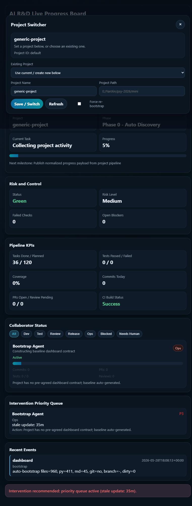

# AI R&D Live Progress Board

Chinese documentation: see [README_ZH.md](README_ZH.md).

## Introduction
`IVX Dashboard` is a standalone live board for AI-driven software delivery. It gives teams a single operational view of execution progress, quality signals, collaborator activity, and intervention priorities.

Chinese product name: `IVX 智能研发实时看板`.

## What it shows
- Current phase, task, milestone, and progress
- CI and testing KPIs
- Collaborator status and workload
- Intervention queue and recent events

## Typical use
Use the board as a control surface during daily delivery:
- start the server
- open the dashboard in browser
- bind or switch a project from the UI
- monitor health/risk and act on intervention items

## Project Overview
- Runtime server: `server.py`
- App entry: `app.py`
- Web UI: `web/index.html`
- Local data: `data/live_progress.json`, `data/dashboard_state.json`

## Installation
1. Install from PyPI:
   - `pip install ivx`
2. Install a pinned version:
   - `pip install "ivx==<version>"`
3. Install from source:
   - `pip install "git+https://github.com/rendao/ivx.git@main"`

## After installation
1. Show available commands:
   - `ivx --help`
2. Start the service:
   - `ivx serve --host 127.0.0.1 --port 8789`
3. Open the dashboard:
   - `http://127.0.0.1:8789`
4. Configure the project in the UI:
   - Click the Project button in the header.
   - Fill project name/path, then Save / Switch.

## Quick Start
1. Start service:
   - `python app.py --host 127.0.0.1 --port 8789`
2. Open dashboard:
   - `http://127.0.0.1:8789`
3. Configure the project in the UI:
   - Click the Project button in the header.
   - Fill project name/path, then Save / Switch.
   - Optionally enable Force re-bootstrap when initializing a new project contract.
